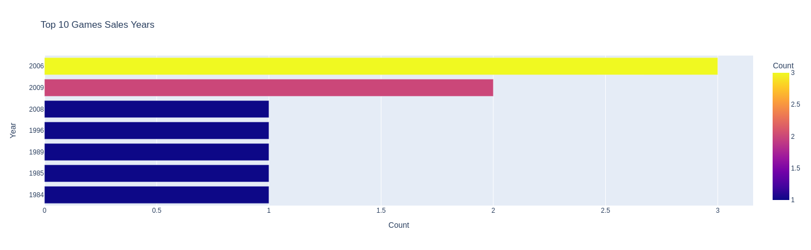
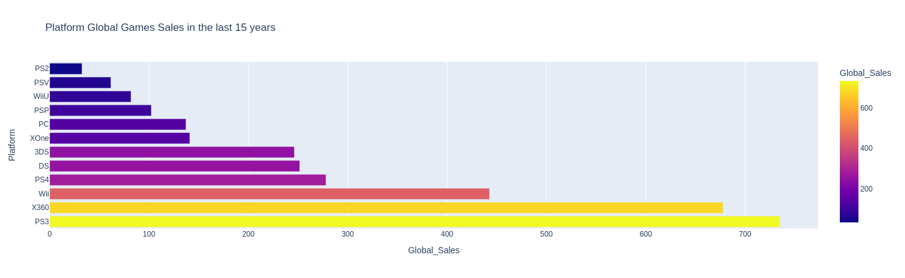
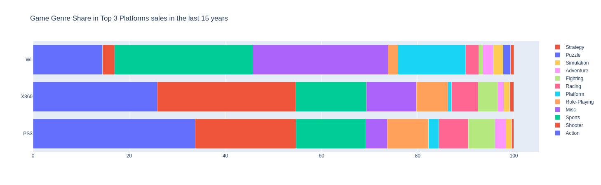
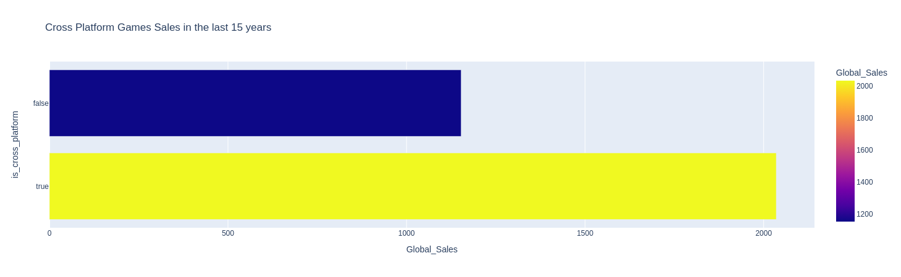
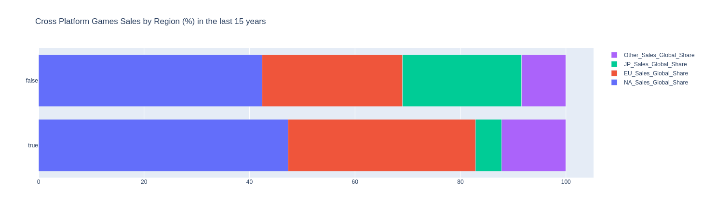

# Boas vindas a **Análise de Vendas de Jogos de Videogames**

Para executar o projeto, observe as orientações descritas a seguir, e se tiver qualquer dúvida, sugestão, contribuição, considere abrir uma issue ou entrar em contato. 🚀

Aqui você vai encontrar os detalhes de como está estruturado e foi desenvolvida a análise.

* ## **Descrição:**
  <details>
    <summary><strong>O desafio</strong></summary>

    * **Desafio:** Análise de Vendas de Jogos de Videogames
    * **Objetivo:**
      Os participantes devem consultar e analisar dados de vendas de jogos de videogames a partir do repositório disponível no Kaggle. O objetivo é criar um pipeline que permita explorar insights sobre as tendências de vendas, plataformas mais populares, e o desempenho de jogos ao longo dos anos.

    ---

  </details>

  <details>
    <summary><strong>Instruções</strong></summary>

    * **Fonte de Dados:**
      Utilize o conjunto de dados disponível em [Kaggle: Vendas de Jogos de Videogames](https://www.kaggle.com/code/lusfernandotorres/vendas-de-jogos-de-videogames/input). 
    * **Tarefas:** 
      * **Consulta e Ingestão:** 
        * Baixar o conjunto de dados; 
        * Carregar os dados em um DataFrame utilizando Pandas. 
      * **Exploração Inicial:** 
        * Visualizar a estrutura dos dados e realizar uma análise exploratória (EDA) para entender as colunas e o tipo de dados.
      * **Limpeza dos Dados:** 
        * Identificar e tratar valores ausentes; 
        * Remover duplicatas; 
        * Corrigir eventuais inconsistências 
      * **Análise de Tendências:** 
        * Identificar as principais plataformas, 
        * Gêneros de jogos mais vendidos, 
        * Evolução das vendas ao longo dos anos. 
      * **Visualização:** 
        * Criar gráficos que mostrem as tendências de vendas;
        * O desempenho por plataforma;
        * Outros insights relevantes. 

    ---

  </details>

  <details>
    <summary><strong>Entrega</strong></summary>

    * **Entrega:** 
      * Um notebook Python (Jupyter Notebook) documentado com a análise, código e visualizações; 
      * Uma breve apresentação (slides ou documento) destacando os principais insights descobertos.
    * **Extras (Opcional):**
      * Implementar uma previsão simples para vendas futuras usando um modelo de regressão linear ou outro algoritmo de aprendizado de máquina. 
      * Publicar a análise em um repositório no GitHub com README explicativo.

    ---
  </details>

* ## **Desenvolvimento:**

  <details>
    <summary><strong>Executando o projeto</strong></summary>

    * ### **Criando ambiente virtual:**
    ```bash
    # game_analysis já considerado no .gitignore
    python3 -m venv game_analysis && source game_analysis/bin/activate
    ```

    * ### **Instalando dependências:**
    ```bash
    pip install -r requirements.txt
    ```

    * ### **Execute o notebook [game_analysis.ipynb](game_analysis.ipynb)**

    ---
  </details>

* ## **Principais achados:**

  <details>
    <summary><strong>Sobre o conjunto de dados</strong></summary>

    Os dados disponíveis no Kaggle apresentam informações sobre vendas de jogos de videogames entre os anos de **1980 e 2020**, com detalhes sobre:

    * Nome do jogo;
    * Posição no ranking de vendas globais;
    * Plataforma;
    * Ano de lançamento;
    * Gênero;
    * Editora; 
    * Vendas do jogo na:
      * América do Norte; 
      * Europa; 
      * Japão; 
      * Global.

    **Há uma grande assimetria nos dados**, com muitos jogos com vendas muito baixas e poucos jogos com vendas muito altas, o que pode influenciar a modelagem de previsão de vendas futuras e eventuais problemas com **_outliers_**.

    **Há poucos valores ausentes**, havendo 16.598 registros nas colunas completas, As coluna `Year` (271 valores ausentes de 16.327 registros) e `Publisher` (58 valores ausentes de 16.540 registros) são as que **apresentam valores nulos mas que não foram tratados** pois com a amostra usada na previsão de vendas futuras e a baixa incidência desses valores **não comprometeram a análise**.

    **Foi identificado um valor duplicado** que foi retirado da amostra. Além dos outliers que vão ser tratados na modelagem dos dados, o único enriquecimento feito pré `feature engineering` foi a verificação de jogos multiplataforma, apresentada na discussão sobre a coluna `Platform`.

    * **Tabela 01 - Tipos das colunas**
      | Column       | Non-Null Count | Dtype |
      |--------------|----------------|-------|
      | Name         | 16598 non-null | object|
      | Platform     | 16598 non-null | object|
      | Year         | 16327 non-null | float64|
      | Genre        | 16598 non-null | object|
      | Publisher    | 16540 non-null | object|
      | NA_Sales     | 16598 non-null | float64|
      | EU_Sales     | 16598 non-null | float64|
      | JP_Sales     | 16598 non-null | float64|
      | Other_Sales  | 16598 non-null | float64|
      | Global_Sales | 16598 non-null | float64|


    ---

  </details>

  <details>
    <summary><strong>Visão inicial</strong></summary>

    ### **Sobre os dados categóricos:**
    O top 5 da quantidade de valores únicos representa **49,66%** das ocorrências em `Platform`, **61,45%** em `Genre` e **30,3%** em `Publisher`. Um overview sobre os dados categóricos:

    - Quantidade de valores únicos em Name: 11493
      - Ocorrências top 5 valores únicos em Name: 
        - Need for Speed: Most Wanted: 12; 
        - FIFA 14: 9; 
        - Madden NFL 07: 9; 
        - LEGO Marvel Super Heroes: 9; 
        - Ratatouille: 9
      - Ocorrências % top 5 em Name sobre o total: 0.29%

    - Quantidade de valores únicos em Platform: 31
      - Ocorrências top 5 valores únicos em Platform: 
        - DS: 2163; 
        - PS2: 2161; 
        - PS3: 1329; 
        - Wii: 1325;  
        - X360: 1265
      - Ocorrências % top 5 em Platform sobre o total: 49.66%

    - Quantidade de valores únicos em Genre: 12
      - Ocorrências top 5 valores únicos em Genre: 
        - Action: 3316, 
        - Sports: 2346, 
        - Misc: 1739, 
        - Role-Playing: 1488, 
        - Shooter: 1310
      - Ocorrências % top 5 em Genre sobre o total: 61.45%

    - Quantidade de valores únicos em Publisher: 578
      - Ocorrências top 5 valores únicos em Publisher: 
        - Electronic Arts: 1351; 
        - Activision: 975;
        - Namco Bandai Games: 932;
        - Ubisoft: 921;
        - Konami Digital Entertainment: 832
      - Ocorrências % top 5 em Publisher sobre o total: 30.3%

    ### **Sobre os valores de `Year`:**
    - Quantidade de valores únicos em Year: 39
      - Ocorrências top 5 valores únicos em Year: 
        - 2009: 1431; 
        - 2008: 1428; 
        - 2010: 1259; 
        - 2007: 1202; 
        - 2011: 1139
      - Ocorrências % top 5 em Year sobre o total: 39.57%

      **Os anos de 2018 e 2019** estão ausentes no conjunto de dados. Porém, **os valores nulos em `Year` são de vários anos** observando os jogos com essa característica, não podendo haver uma substituição direta dos valores nulos para o intervalo desses anos.
      
      Com essa quebra na série histórica que pode comprometer análises temporais se evitou análises temporais para essas avaliações iniciais.

    ---

  </details>

  <details>
    <summary><strong>Top 10 de vendas</strong></summary>

    `Dos 10 jogos mais vendidos`, destaca-se que **todos são da Nintendo** e que nessa ordem, os mercados que mais o adquiriram são da América do Norte (maior share para todos os jogos), Europa e Japão.
    
    `Wii Sports`, o mais vendido, tem mais do que o dobro de vendas do segundo colocado. 
    
    `Mario` e `Wii`, são termos parte do nome de 4 dos 10 jogos mais vendidos.

    * **Tabela 02 - Top 10 jogos vendidos**

    | Rank |	Name	| Platform |	Year	| Genre |	Publisher |	Global_Sales | NA_Sales_Share |	EU_Sales_Share	|JP_Sales_Share |	Other_Sales_Share |
    |------|---------|----------|-------|-------|-----------|--------------|-----------------------|-----------------------|----------------------|--------------------------|
    | 1	  | Wii Sports	| Wii	| 2006	| Sports	| Nintendo	| 82.74	| 50.15	| 35.07	| 4.56	| 10.22 |
    | 2	  | Super Mario Bros.	| NES	| 1985	| Platform	| Nintendo	| 40.24	| 72.27	| 8.90	| 16.92	| 1.91 |
    | 3	  | Mario Kart Wii	| Wii	| 2008	| Racing	| Nintendo	| 35.82	| 44.25		| 35.96	| 10.58	| 9.24 |
    | 4	  | Wii Sports Resort	| Wii	| 2009	| Sports	| Nintendo	| 33.0	| 47.73	| 33.36	| 9.94	| 8.97 |
    | 5	  | Pokemon Red/Pokemon Blue	| GB	| 1996	| Role-Playing	| Nintendo	| 31.37	| 35.93	| 28.34		| 32.58	| 3.19 |
    | 6	  | Tetris	| GB	| 1989	| Puzzle	| Nintendo	| 30.26	| 76.67	| 7.47	| 13.95	| 1.92 |
    | 7	  | New Super Mario Bros.	| DS	| 2006	| Platform	| Nintendo	| 30.01	| 37.92	| 30.76	| 21.66	| 9.66 |
    | 8	  | Wii Play	| Wii	| 2006	| Misc	| Nintendo	| 29.02	| 48.35	| 31.70		| 10.10	| 9.82 |
    | 9	  | New Super Mario Bros. Wii	| Wii	| 2009	| Platform	| Nintendo	| 28.62	| 50.98		| 24.67		| 16.42	| 7.90 |
    | 10	| Duck Hunt	| NES	| 1984	| Shooter	| Nintendo	| 28.31	| 95.13	| 2.23	| 0.99	| 1.66 |

    Ainda sobre o top 10 os seguintes números se destacam sobre as plataformas e gêneros dos jogos:
    
    | Top 10 Sales Platforms||
    |-|-|
    |Platform| Count|
    |Wii  |  5|
    |NES  |  2|
    |GB  |   2|
    |DS |    1|

    | Top 10 Sales Genres||
    |-|-|
    |Genre| |Count|
    |Platform |  3|
    |Sports |   2|
    |Role-Playing | 1|
    |Racing |  1|
    |Puzzle |  1|
    |Misc |    1|
    |Shooter |  1|

    Reforçando o resultado da tabela 02, as regiões com maior share de vendas são destacadas abaixo:

    * **Gráfico 01 - Top 10 vendas de jogos por região**

    

    Com a visão do ano de lançamento dos jogos do top 10, destaca-se o ano de 2006 com 3 jogos, seguido de 2009 com 2 jogos, além de 3 jogos da década de 80.

    * **Gráfico 02 - Top 10 vendas de jogos por ano**

    

    ---

  </details>

  <details>
    <summary><strong>Plataformas e outras dimensões</strong></summary>

    **Para as análises de plataformas, gêneros e publishers, foram considerados os valores dos últimos 15 anos**, à partir de 2009, para evitar a influência de jogos mais antigos que poderiam distorcer as análises com títulos ou distribuidoras não mais comercializados ou em atividade.

    ### **Vendas por Plataforma:**

    São 12 plataformas com jogos lançados desde 2009, elencadas pela quantidade de vendas globais abaixo:

    * **Tabela 03 - Vendas de jogos por Plataforma desde 2009**

    | Platform | Global_Sales | NA_Sales_Share | EU_Sales_Share | JP_Sales_Share | Other_Sales_Share |
    |----------|--------------|----------------|----------------|----------------|-------------------|
    | PS3 |  734.77 | 39.57 | 36.30 |9.27 | 14.85|
    | X360 |  677.81 |60.03 | 30.27 |1.09 |8.58 |
    | Wii | 442.77 |54.89 | 29.02 | 7.75 |8.28 |
    | PS4 | 278.1 |34.81 | 44.48 | 5.14 |15.59|
    | DS | 251.68 |49.78 | 22.60 | 20.70 |6.87|
    | 3DS | 246.28 |31.68 | 23.67 |39.51 |5.10 |
    | XOne | 141.06 |58.97 | 32.36 |0.24 |8.45 |
    | PC | 137.21 |28.69 | 58.03 |  0.00|13.07|
    | PSP |  102.34 |21.68 | 18.35 |49.24 | 10.91|
    | WiiU |  81.86 |46.81 | 29.60 | 15.62|7.88 |
    | PSV |  61.63 |26.07 | 26.40 |33.90 |13.65 |
    | PS2 |  32.55 |35.88 | 20.31 | 8.42| 35.21|

    O destaque é o domínio do top 3, com **PS3, X360 e Wii**, esse último tendo 5 jogos do top 10 de vendas globais, inclusive o mais vendido, apesar de não estar no topo no consolidado das plataformas.

    * **Gráfico 03 - Vendas de jogos por Plataforma desde 2009**

    

    Olhando para as regiões, se vê uma distribuição de preferências entre as plataformas. **A América do Norte é o maior consumidor de 7 plataformas**.

    * **Gráfico 04 - Vendas regionais de jogos por Plataforma desde 2009**

    

    Na sequênca diferente do consolidado vem o Japão, sendo o maior consumidor do `3DS`, `PSP` e `PSV`. 6º, 9º e 11º em vendas globais respectivamente. A Europa é o maior consumidor do `PS4` e `PC`, esse último sem vendas no Japão.

    ### **Plataformas e gêneros:**
    Olhando o gênero dos jogos com mais de 10% de share nas vendas das 3 principais plataformas , observa-se que 3 ou 4 gêneros são os mais vendidos em cada plataforma.

    * **Tabela 04 - Gêneros dos jogos mais vendidos por plataforma desde 2009**

    | Platform | Genre | Global_Sales | Genre_Share | Genres_Shares |
    |----------|-------|--------------|-------------|---------------|
    | PS3 | Action|247.84 |33.73 | 69.20|
    | PS3 | Shooter|154.12 |20.98 | 69.20|
    | PS3 | Sports|106.50 |14.49 | 69.20|
    | Wii |Sports | 127.12|28.71 | 85.31|
    | Wii | Misc| 124.56| 28.13|85.31 |
    | Wii |Action |64.01 |14.46 | 85.31|
    | Wii | Platform|62.01 | 14.01| 85.31|
    | X360 | Shooter|195.30 |28.81 | 79.76|
    | X360 | Action|174.94 | 25.81| 79.76|
    | X360 | Sports|99.86 |14.73 | 79.76|
    | X360 | Misc| 70.57|10.41 |79.76 |

    * **Gráfico 05 - Gêneros dos jogos mais vendidos por plataforma desde 2009**

    

    Destaca-se dos gêneros `Action`, `Sports` e `Shooter`, os 3 principais do **PS3** e **X360**, e os 2 primeiros presentes no top 4 do **Wii**.

    No PS3 os 3 gêneros representam 69,2% das vendas da plataforma. No Wii e X360 os 4 com mais de 10% de share representam 85,31% e 79,76% respectivamente, destacando o gênero como feature potencial para projeção das vendas.

    ### **Plataformas e distribuidoras:**
    Cruzando as vendas das 3 principais plataformas agregadas por distribuidoras com mais de 10% de share nas vendas, observa-se o papel das distribuidoras associadas com as plataformas nas suas vendas. 
    
    **`Sony`, `Microsoft` são a 2ª segunda distribuidora mais importante nas vendas do `PS3` e `X360`**, e **a `Nintendo` a principal do `Wii`**, plataformas que também fabricam.

    * **Tabela 05 - Distribuidoras dos jogos mais vendidas por plataforma desde 2009**

    | Platform | Publisher | Global_Sales | Publisher_Share | Publishers_Shares |
    |----------|-----------|--------------|-----------------|-------------------|
    | PS3 | Electronic Arts|  131.96| 17.96|  45.38|
    | PS3 | Sony Computer Entertainment| 100.74| 13.71|  45.38|
    | PS3 | Activision|  100.73| 13.71|  45.38|
    | Wii | Nintendo|  140.81| 31.80|  46.87|
    | Wii | Ubisoft|  66.74| 15.07|  46.87|
    | X360 | Electronic Arts|  126.26| 18.63|  51.36|
    | X360 | Microsoft Game Studios|  113.07| 16.68| 51.36|
    | X360 | Activision|  108.80| 16.05|  51.36|

    `Electronic Arts` e `Activision` são a 1ª e 3ª distribuidora em vendas do `PS3` e `X360`, e a `Ubisoft` é a 2ª do `Wii` com mais de 10% de share nas vendas, sendo a distribuidora outra feature potencial para projeção das vendas.

    ### **Multiplataformas:**
    Observando que há jogos com o nome repetido mas únicos por plataforma, buscou-se analisar as vendas dos jogos lançados em mais de uma plataforma.

    * **Gráfico 06 - Vendas de jogos multiplataforma**

    

    A soma das vendas dos jogos multiplataforma é quase que o dobro dos demais, apesar da diferença em torno de 10% da quantidade de jogos multiplataforma à partir de 2009 (3469 contra 3105 exclusivos de uma plataforma).
    
    Olhando as vendas por região, eles também tem uma fatia importante de mercado:

    * **Gráfico 07 - Vendas de jogos multiplataforma por região**
    
    

    Com exceção do Japão, as vendas dos jogos multiplataforma superam as vendas dos jogos exclusivos, sendo uma potencial feature relevante para a modelagem de previsão de vendas futuras.

    ---

  </details>

* ## **Projeção das venda preliminares:**

  <details>
    <summary><strong>Premissas</strong></summary>

    ### **Amostra:**
    **Para projeção das vendas, foi considerado o mesmo recorte de 15 anos da análise das plataformas**, buscando garantir uma menor latência entre a amostra e a projeção.

    **Com esse corte temporal tem-se 6.574 registros sem valores nulos**, aproveitando da limpeza de dados duplicados (um registro) e a criação de uma feature para jogos multiplataforma da etapa de análise.

    Da amostra, **foram separados 30% dos valores para teste e 70% para treino**.

    ### **Feature Engineering:**
    Para a modelagem, foram criadas as seguintes features:

    * **Valores categóricos:**
      * `Platform`*
      * `Genre`*
      * `Publisher`*
      * `is_cross_platform`: booleano que verifica jogos multiplataforma caso aja valores duplicados de `Name`, `Genre` e `Publisher`
      * `is_producer_platform`: booleano que verifica se a `Publisher` é a mesma produtora da `Platform` do jogo**.

    * **Valores numéricos:**
      * `na_sales_log`***
      * `eu_sales_log`***
      * `jp_sales_log`***
      * `other_sales_log`***

    * **Target**
      * `global_sales_log`***

      **\*Dummies**

      **\*\*Mapa da Plataforma e Publisher:**

      | Publisher | Platformas |
      |-----------|------------|
      | Microsoft Game Studios | X360<br/>XOne |
      | Nintendo | Wii<br/>WiiU<br/>DS<br/>3DS |
      | Sony Computer Entertainment | PS3<br/>PS4<br/>PSP<br/>PSV<br/>PS2 |

      **\*\*\*Transformação dos valores de vendas com a função: ln(1+x)**

    ---

  </details>

  <details>
    <summary><strong>Resultados iniciais</strong></summary>

    ### **Matriz de confusão:**
    **Para a modelagem, foram utilizados os algoritmos de Regressão Linear e Random Forest**, por conta dos valores extremos e a distribuição dos dados, com a regressão podendo indicar futuras melhorias na modelagem, e o Random Forest equilibrando a distribuição dos dados.

    **Para avalição dos modelos foi utilizado o erro quadrático médio (MSE)**, que indica a média dos quadrados dos erros, ou seja, a diferença entre o valor real e o valor previsto ao quadrado.

    O modelo com o **Random Forest** apresentou o menor MSE, 0,0013 contra 5,89 do modelo de **Regressão Linear**, com seus preditores seguindo para construção da matriz de confusão, apresentada abaixo:

    * **Matriz de confusão - Random Forest:**

    |1747 | 3 |
    |:-----:|:---:|
    | 3 | 220 |

    Com 1748 valores verdadeiros positivos, 220 verdadeiros negativos, 2 falsos positivos e 3 falsos negativos, o modelo de Random Forest apresentou uma acurácia de 99,7% o que pode indicar overfitting além de problemas das features como multicolinearidade a serem investigados.

    ---

  </details>


* ## **Próximos Passos:**
  * **Previsão de vendas**
      * **Feature Engineering**; OK
          * **Normalização dos dados numéricos (valores relativos ou log)**; OK
          * **Conversão de variáveis categóricas (dummies)**; OK
          * **Avaliar tirar Outras Vendas (pouca representatividade)**; OK
          * **Análise de correlação entre as variáveis**;
          * **Análise de multicolinearidade entre as variáveis**.
      * **Modelagem**
          * **Regressão Linear (com a normalização dos dados)**; OK
          * **Random Forest**; OK
          * **XGBoost**;
  *  **Análise temporal**
      * Vendas ao longo dos anos;
      * Vendas por região ao longo dos anos;
      * Vendas por gênero ao longo dos anos;
      * Plataforma mais longeva;
      * Principais publishers ao longo dos anos.
